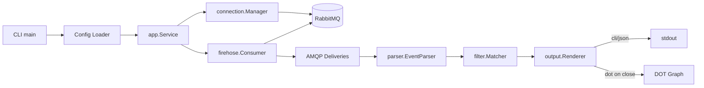

# Architecture Diagram

```mermaid
flowchart LR
    A[CLI main] --> B[Config Loader]
    B --> C[app.Service]
    C --> D[connection.Manager]
    D --> E[(RabbitMQ)]
    C --> F[firehose.Consumer]
    F --> E
    F --> G[AMQP Deliveries]
    G --> H[parser.EventParser]
    H --> I[filter.Matcher]
    I --> J[output.Renderer]
    J -->|cli/json| K[stdout]
    J -->|dot on close| L[DOT Graph]
```
